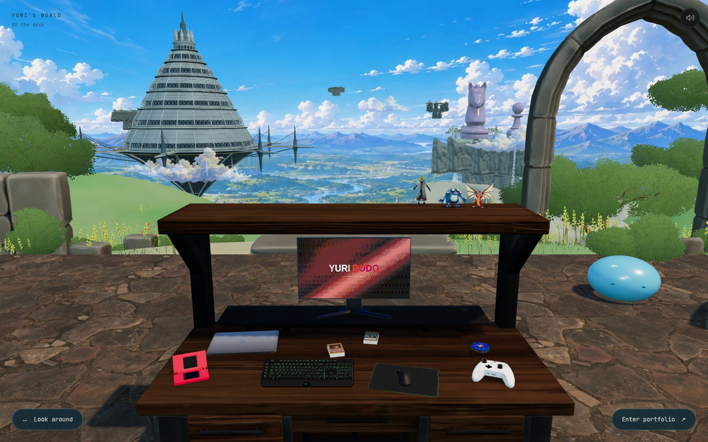
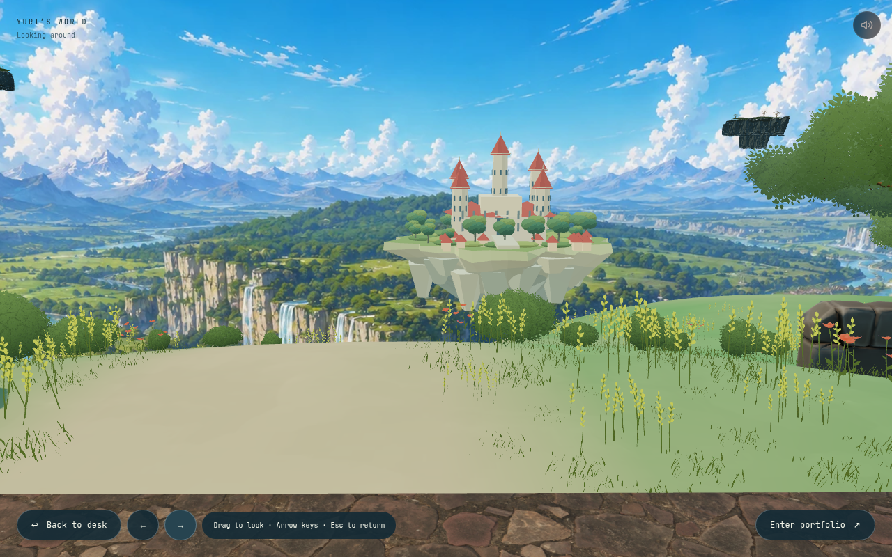

# Skybound: explorable environment and replacement landmarks

Updated for PR review on 2026-09-08. The user rejected the original blockout's basic geometry and then explicitly asked for less cartoon-like paving. Concept 05 remains the composition reference; the blockout is not an accepted final art standard.

## What changed in this revision

The original desk, collectibles, seated framing and monitor entrance are preserved. The near world now uses selected authored FreeStylized arch/wall/rubble and nature assets, retaining atlas UVs, baked normal maps and ambient occlusion. Meshes are instanced after correctly decoding their compressed node transforms. Foliage writes depth, has smooth canopy normals/color gradients, and restrained wind.

The oversized rounded paving blocks were removed. The replacement uses real-scale monastery stone paving with narrower joints, subtle surface relief, roughness and ambient occlusion. A thin physical base gives its boundary thickness. This is a restrained PBR floor, not a toon material. Small worn stairs connect it to a heightfield with soil/grass color variation and grouped plants. Adapted eroded cliff meshes provide actual midground depth. The terrain, vegetation and architecture remain visible when turning around.

The far world remains hybrid: a surrounding sky sphere plus feathered front and rear scenic paintings. These provide distant scenery, not the inhabitable near environment. The citadel now uses six distinct architectural districts, open galleries, a structural undercroft and long satellite bridges. The knight/pawn use credited sculpted marble geometry on an eroded island with plinths, a court, trees and animated waterfalls. Small satellite islands also use the eroded-rock assembly. The rear academy remains **provisional**. Visual acceptance of the overall scene is still open; these changes do not establish the requested final quality level.

The change in workflow follows first-person [environment production research](../../../assets/lobby-world/research/asset-sources.md): establish a representative area, use intentionally authored assets, retain baked surface information, then evaluate material/scale/contact together in the actual engine. Downloading a better asset does not by itself finish the scene.

## Runtime captures

Actual Chromium app renders, not generated concepts. The development indicator is hidden. The final captures use native OpenGL on the available NVIDIA RTX 3050 Laptop GPU. Earlier diagnostic captures used SwiftShader.





Additional captures: [1280 × 720 laptop](implementation/laptop.png), [1920 × 1080 desktop](implementation/wide.png), [390 × 844 mobile fallback](implementation/mobile.png).

## Interaction and resilience

`Look around` enables seated rotation by dragging, navigation buttons or arrow keys while the navigation controls have focus. Pitch is bounded. `Back to desk` and Escape restore the pose and focus. Entering from another view first returns to the desk, then hands the camera to the existing monitor transition. Escape at the desk skips the lobby. Keyboard equivalents for collectibles become visible when focused.

Core readiness follows desk assets and two rendered frames. Decorative assets have independent error/Suspense boundaries. A failed architecture, foliage, floor or landmark asset must not block entry. Skip remains available during loading; a 20-second core-load timeout prevents a permanent loader. Existing mobile, reduced-motion and GPU bypasses remain.

## Asset delivery

Seventeen currently requested world files total **10,043,670 bytes (10.04 MB)** on disk, excluding the original desk/UI payload and HTTP compression. This is not a GPU-memory measurement. Legacy terrace/citadel/chess/satellite GLBs and the limestone/foliage-sprite studies remain in the folder for the older generator, but are not requested by this world composition.

| Runtime group | Delivery |
| --- | --- |
| Authored ruins kit | 665,864 bytes; shared 1K atlases, meshopt geometry |
| Authored nature kit | 526,780 bytes; reused by instancing |
| Adapted cliff | 718,944 bytes; simplified scan with retained UVs |
| Paving | 2K color, 1K normal, 512² roughness/AO; 1,067,224 bytes total |
| Terrain maps | Two 1K maps; 20,838 bytes |
| Replacement landmarks + academy | Four meshopt GLBs; 5,822,608 bytes |
| Far sky/landscape/cloud | Four WebP images; 1,221,412 bytes |

One 1024² directional shadow map covers the desk/near region. Distant landmarks do not cast shadows. DPR is capped at 1.5. Original desk materials remain. PBR environment materials follow the shared lighting dimmer; the far painted layers have explicit dimming.

[Asset provenance, source layout and reproducible processing](../../../assets/lobby-world/README.md) and [public attribution](../../../public/CREDITS.md) distinguish FreeStylized's custom royalty-free project license from Poly Haven's CC0 assets. Original third-party packs are not committed.

```sh
pnpm dev
pnpm test:browser
# Rebuild provisional landmarks only:
pnpm assets:world
# Rebuild authored kit after obtaining the credited source packs:
blender --background --factory-startup --python scripts/prepare-world-assets.py -- --source-dir /path/to/SOURCE
node scripts/optimize-world-assets.mjs /path/to/SOURCE
```

Set `PLAYWRIGHT_CHROMIUM_EXECUTABLE_PATH` for an existing Chromium binary. Set `PLAYWRIGHT_HARDWARE_GPU=1` to test native OpenGL without overriding GPU identification. Tests override renderer identification only inside their browser context to exercise WebGL under software rendering; production GPU detection is unchanged.

## Verification and remaining work

Production build, TypeScript and all 9 existing physics tests passed after the authored-asset integration and floor replacement. Targeted ESLint passed. All 6 browser regression tests passed on the native RTX 3050 renderer (40.0 seconds): camera navigation/return/entry, collectible controls and real monitor raycast, delayed core loading/skip, failed authored world assets, reduced motion, and mobile bypass. The earlier software run passed 5/6; its remaining failure was a test polling a sub-second transition after it had already completed. That assertion now records DOM state changes in-page and verifies return-before-entry ordering and the disabled button. Repository-wide lint has four pre-existing errors in untouched keyboard, mouse and custom-cursor components, plus existing warnings.

This revision does not establish AAA visual quality. Remaining art work is concrete: refining citadel/chess presentation and replacing the academy, better terrain/plant coverage at the platform boundary, less visible repetition in foliage, and a more coherent transition from midground geometry to distant painting. The rear academy is inspired architecture, not a verified Ranoa replica. Integrated-GPU, GPU-memory and cold-load profiling remain necessary. A local warm-frame diagnostic is available through `scripts/profile-world.mjs`; its scope and actual measurements are recorded in `implementation/frame-profile.json`. It cannot establish performance on other machines.


## Local production warm-frame diagnostic

The production build at 1440 × 900, DPR 1, was sampled for 180 frames per view on the available NVIDIA RTX 3050 Laptop GPU. Mean browser cadence was **47.4 FPS at the desk** (median 16.7 ms, p95 33.4 ms) and **58.7 FPS looking back**. Main-view submissions averaged 242 draw calls and 1,335,673 triangles including shadow passes. No browser runtime errors were recorded.

This is a short, warmed headless-browser observation on one machine with other applications running, not an isolated GPU timing or a general 60 FPS claim. The main view needs further optimization. [Raw result](implementation/frame-profile.json). The captured time is UTC; this run took place on September 8 in São Paulo.

```sh
WORLD_PROFILE_URL=http://localhost:3001 node scripts/profile-world.mjs
```
