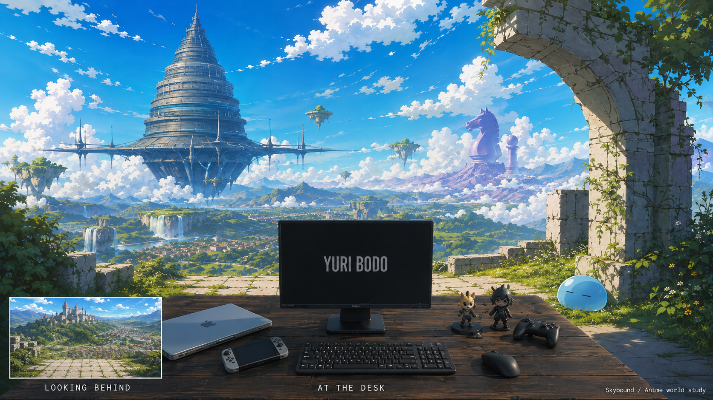
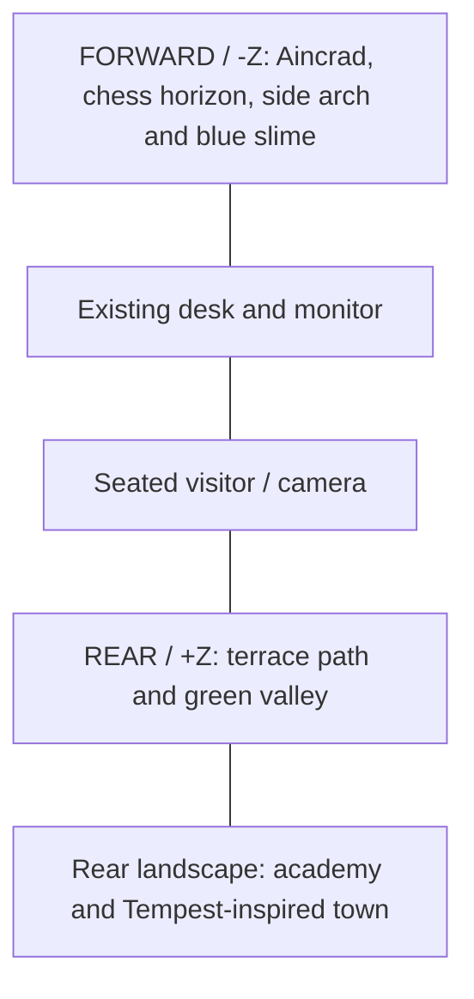

> Current implementation update (September 12): the user's subsequent review supersedes this plan's panorama-based background. The runtime now uses a connected 3D valley, authored village assets and procedural volumetric atmosphere. See [the current art/rendering pass](atmosphere-village-polish.md). Historical plan decisions below remain for context.

# Skybound: an anime world around the desk

Date: 2026-09-07
Status: concept approved and implementation authorized; the initial blockout was rejected as the final quality level. An explorable version and replacement citadel/chess landmarks are implemented locally; see [implementation notes and runtime captures](implementation.md). The recommendations below remain the original design targets, not a claim that every future polish item is complete.

The user likes the existing desk and Skybound's expansive, creative environment. The world must surround the seated visitor, including behind the seat, and visibly reference their favorite anime. Their correction is decisive: recognizable anime environments and drawn anime art, with less realistic material rendering. The original forest alternative is not the recommended direction.

The named references are That Time I Got Reincarnated as a Slime, Mushoku Tensei, Sword Art Online, and “No life,” provisionally understood as No Game No Life. Additional isekai references were researched but are secondary.

The large view is now the initial view facing the desk: Aincrad and the chess monuments are visible above and beside the monitor. The inset shows the academy and town behind the visitor. This implements the user's correction, “o meu behind the scene poderia ser o at the desk.” These are generated art studies, not an actual render, a calibrated pair of opposing cameras, or a usable 360° texture. Generated desk models, proportions, fonts, and monitor contents are illustrative; the repository's actual desk and UI are the implementation baseline. The inset is an explanatory image annotation, not a proposed website minimap.

## Visual thesis

A familiar developer's desk sits on an open terrace in a world assembled from the anime Yuri loves. From the first frame, looking above the monitor reveals an impossible floating fortress and distant chess monuments. Turning around reveals the academy and inhabited valley town.

Intended qualities: recognizable, wondrous, inhabited. Avoid: generic fantasy scenery, realistic game-render materials, competing landmarks everywhere.

Hierarchy: the monitor remains the primary portfolio entry when facing the desk; Aincrad anchors the upper-left skyline without covering or visually merging with it; smaller references reward looking around. Keep a quiet visual area around the monitor's text and interactive objects.

Signature: the visitor immediately recognizes Aincrad's silhouette above their everyday desk. The juxtaposition supplies the arrival moment; looking around extends the experience but is not required to see its strongest feature.

## References translated into the world

These are proposed visual interpretations, not claims that these anime share a canonical world.

| Reference | Recognizable feature | Proposed placement | How it fits |
| --- | --- | --- | --- |
| Sword Art Online / Aincrad | Stacked circular floors, tapered tower, broad projecting platforms and suspended underside | Front-left sky, visible above and to the left of the monitor | The silhouette should read before architectural detail; clouds partially overlap the base to convey scale |
| No Game No Life / Disboard | Mountain-sized chess knight and pawn; lavender/cyan distance colors | Front-right horizon, smaller and paler than Aincrad | The chess shapes supply a second clear recognition without a second equally dominant castle |
| Mushoku Tensei | Ranoa-inspired academy: grouped stone towers, conical roofs, fortified approach | Rear landscape, discovered by turning away from the desk | Gives the world a place one can imagine traveling to; use a verified academy turnaround before modeling |
| Slime / Tempest | Ordered town avenues and a green valley settlement; a small blue Rimuru slime | Town behind the seat; slime beside the arch on the front-right terrace | Town structure gives context; the slime is the unambiguous recognition cue visible on arrival |
| Re:Zero, secondary | Layered town streets, civic arches, lived-in stonework | Architecture study for the approach and settlement | Supporting composition only in v1; no extra major landmark |
| KonoSuba, secondary | Approachable adventurer-town scale and readable settlement layout | Town density study | Optional future reference; generic red-roof towns alone are not a reliable franchise cue |

The Mushoku still inspected during research establishes palette and scenic architecture; it is not sufficient evidence for a dimensionally accurate Ranoa replica. Before final asset creation, collect front/side academy references from the relevant episodes or official materials and check roof/tower proportions. The concept currently communicates the inspiration more strongly than exact geography.

The additional franchises should not displace the user's four favorites. Re:Zero and KonoSuba are research inputs, not assumed personal favorites.

## Current direction: a continuous valley

The user approved the revised terrace and near environment, then requested that the distant view feel like reachable places in one world. The latest implementation replaces the flat landscape backdrops with connected 3D terrain, river, roads, bridges and settlements; see [continuous valley implementation and evidence](continuous-valley.md). Preserve the now-approved foreground. The camera remains seated; walking gameplay has not been requested or implemented.

## September 12 correction

The user rejected the rendered environment's mixed asset styles and corrected the floor direction again: the previous approval of the rocky paving is superseded. The current pass returns to the approved concept's quiet, pale cut-stone terrace with narrow joints, shared limestone pigment on floor and architecture, a planted perimeter and consistent matte landmark materials. Stone is the working floor assumption; an optional question offering stone, wood or natural ground has not been answered. See [September 12 implementation review](implementation-2026-09-12.md). Visual acceptance is still open.

## Earlier art correction

The user explicitly rejected basic geometry as final art and found the paving too cartoon-like. Near materials should be more grounded: flatter stone, smaller joints, subtle relief and authored silhouettes. Anime direction comes from composition, architecture, palette and atmospheric depth; it does not require exaggerated toy-like surfaces. See [production research and asset intake](../../../assets/lobby-world/research/asset-sources.md). The original targets below are historical where they conflict with this correction.

## Art direction

- Drawn silhouettes and fine colored contours. Use linework selectively on landmarks, masonry joins, and nearby props; distant foliage becomes painted masses.
- Broad, designed light and shadow shapes. Nearby environmental props use roughly three tonal bands; distant scenery uses painterly transitions.
- Rich cyan sky, warm white cloud shapes, fresh green terrain, pale stone, and lavender atmospheric distance near the chess monuments.
- Simplified surfaces with hand-painted color variation. Avoid photographic normal maps, roughness noise, realistic individual grass blades, film grain, and camera depth of field.
- Keep the current desk geometry and collectible interactions. Integrate its materials through coherent sun direction, soft sky fill, and restrained exposure adjustments. A full toon conversion of the desk is outside this proposal.
- Keep Archivo and JetBrains Mono, with existing system-sans and monospace fallbacks. Preserve actual monitor art and portfolio entry treatment. The fantasy world supplies the new identity around it.
- Small DOM controls use the existing mono styling, consistent spacing, and opaque-enough surfaces for contrast against sky. They are separate from the generated inset's illustrative controls.

| Color role | Initial direction |
| --- | --- |
| Sky | #168CD8 |
| Sunlit clouds | #FFF3D8 |
| Grass and canopy | #5E9E4B |
| Sunlit stone | #DDD2AF |
| Distant magical terrain | #A3A1D6 |
| Desk/UI anchor | Existing dark desk and site tokens |

These are starting art swatches, not verified UI contrast pairs. The No Game No Life color accent now has a specific reference rationale; the earlier generic-fantasy prompt's purple exclusion does not govern this revision.

## Spatial layout and camera experience

Retain the actual seated camera baseline: position (0, 0.4, 1.9), target (0, -0.05, -0.2), vertical FOV 50°. Desk top is y = 0. Its rendered width is normalized to 1.6 units. Source comments about camera elevation differ from the current constants; use the constants and rendered scene.

At rest the camera faces approximately -Z. Physically behind the visitor is +Z beyond the seat, not the space behind the monitor.

The terrace extends several meters around the desk and camera, with ground visible under the desk and along both sides. Determine floor height from the transformed desk's actual feet; the existing contact-shadow plane at y = -0.4 is not evidence of the correct floor. Nearby arches and rocks must be real geometry where camera motion reveals edges.

Distribute references around 360°. The initial monitor view contains the strongest cues: Aincrad, chess monuments and the small slime. The academy and town provide a quieter opposite direction. Preserve enough sky and side scenery that visitors immediately know they are outdoors even if they never turn. Fit the selected composition to the actual 50° camera before final painting: adjust world landmark placement and scale first, preserving the desk framing the user likes.

Recommended interaction, still a proposal:

1. Enter directly at the desk with its familiar subtle pointer drift. Show visible “Look around” and “Enter portfolio” controls immediately.
2. “Look around” enables drag-to-turn from the seat, with full horizontal rotation and bounded vertical pitch (starting range: 30° down to 55° up). No translation, orbit around the desk, or pointer lock.
3. Show “Back to desk” persistently. Keyboard users can turn with arrow keys while the look control is focused and activate the same return action.
4. Return interpolates to the exact existing desk pose in approximately 600–800 ms, with no roll or zoom. Restore focus to the initiating control.
5. Escape while looking returns to the desk; Escape in normal desk mode retains the existing skip behavior. This requires a coordinated change to the current global Escape listener.
6. “Enter portfolio” stays available while looking. Return to the desk first, then run the existing monitor dive; lock repeated entry/turn commands during this handoff.

Do not overload the existing lobby state “exploring” to mean camera look mode. Keep a separate view mode such as desk / looking / returning, coordinated with the existing loading / idle / exploring / booting / done lifecycle. Only one system may own the camera at any moment.

Optional look-around remains recommended because it makes the rear world inspectable without delaying access to the portfolio. No arrival camera move is needed to reveal the main spectacle after the user's spatial correction.

## Technical approach

Use the existing Next.js, React Three Fiber, Drei, Three.js and GSAP stack. This is an environment-art and scene-composition project; it does not require a new rendering engine.

| Layer | Implementation | Purpose |
| --- | --- | --- |
| Desk | Existing models and interactions | Preserve the work the user likes |
| Near environment, roughly 0–12 scene units | Small GLB terrace/arch/rocks; instanced stylized foliage; simple slime mesh | Ground contact, occlusion and real parallax |
| Main floating fortress | Simplified 3D silhouette with repeated tiers and painted atlas, at a scaled distant placement | Crisp recognition, overlap with cloud layers, controlled perspective |
| Far academy/town/chess landscape | Painted panorama initially; promote a landmark to geometry only if motion reveals a need | Detailed anime atmosphere at modest runtime cost |
| Distant sky and terrain | One coherent equirectangular panorama or six matched cubemap faces | Surround the visitor in all directions |
| Ambient motion | A few cloud meshes/cards, foliage motion, sparse particles | Keep the world alive without visual noise |
| Lighting | One sun, sky fill, desk-specific tuning, compatible reflection map | Make existing objects sit in the new environment |

A 360° texture changes correctly as the camera rotates but has no positional parallax. Nearby geometry provides that depth. The small seated drift and brief forward monitor dive make the hybrid practical; free walking would require a different asset strategy. Three.js supports these panorama/cubemap approaches directly. [Backgrounds and skyboxes](https://threejs.org/manual/en/backgrounds.html).

For nearby environment meshes, start with painted albedo and vertex color; test MeshToonMaterial with a three-step gradient for crisp light bands. For distant artwork, preserve the painted colors with unlit materials. A toon shader alone cannot turn realistic assets into a convincing anime scene; shape design and painted textures carry most of the style. Toon materials support a gradient map with nearest filtering. [MeshToonMaterial](https://threejs.org/docs/pages/MeshToonMaterial.html).

Keep the desk's existing physical materials initially. Toon materials and physical materials respond differently to lighting; inspect their combination in the actual scene before committing to a shader system. Try colored outline geometry only on selected nearby objects if needed, after measuring cost.

Avoid a full-screen outline or bloom pass in the first iteration. Architectural linework can be painted; sunlight can be authored into the panorama. Real-time volumetric clouds and a day/night cycle add cost without resolving the core brief.

## Asset production workflow

1. Lock the revised front and rear composition, franchise cues, and anime treatment. Produce exact camera-matched paintovers from screenshots of the existing scene when implementing.
2. Block out terrace, arch and simplified Aincrad in Blender or scene primitives. Check scale, rear view, monitor readability and desktop crops before detailed art.
3. Author an environment master scene with a fixed sun and consistent horizon. Paint or project the approved anime artwork onto the far scenery; render a coherent 360° panorama from the seated location. An artist can instead paint the panorama directly.
4. Check horizontal seam, zenith, nadir, landmark orientation and perspective at every yaw angle. A normal landscape image stretched to 2:1 is not a valid panorama. AI generation can assist art creation, but does not remove seam correction and perspective work.
5. Keep terrace, arch, slime and moving clouds out of the far bake. Keep the hero fortress out too if it is rendered as geometry, avoiding duplicate silhouettes.
6. Export near geometry and hero silhouette as small GLBs; use limited painted texture atlases. Validate Meshopt/Draco decoding against the installed Drei loader before shipping compressed geometry. The existing compression script is a starting point, not proof that every export is supported.
7. Supply a small consistent reflection environment separately from the visible art. Do not assume an ordinary LDR painting provides the right light intensities or that changing scene.background automatically changes scene.environment. Drei allows background and environment handling to be configured separately. [Environment documentation](https://raw.githubusercontent.com/pmndrs/drei/master/docs/staging/environment.mdx).
8. Deliver a lightweight base panorama first and optional higher resolution only after the core scene is usable. Keep downloaded reference stills out of the shipped website; production assets are separately authored.

## Repository integration plan

| File / proposed component | Planned responsibility |
| --- | --- |
| components/lobby/desk-scene.tsx | Mount world layers; coordinate readiness, view-mode controls, error handling and entry sequence |
| components/lobby/desk-environment.tsx | Replace dark fog and warehouse lighting with the new world treatment; expose unified dimming |
| components/lobby/camera-rig.tsx | Add seated look mode and return; suspend drift during look, return and dive |
| components/lobby/world/isekai-world.tsx (new) | Compose near scenery, hero silhouette and far background |
| components/lobby/world/world-atmosphere.tsx (new) | Clouds/foliage/particles with a quality tier |
| components/lobby/world/world-controls.tsx (new) | Visible DOM look, return and entry controls, keyboard behavior |
| lib/lobby/world-assets.ts (new) | World manifest and staged asset loading, separate from global desk preloads |
| lib/lobby/transition.ts | Coordinate camera return and world dimming with the existing monitor dive |
| public/lobby/world/ (new, during implementation) | Optimized production assets and their provenance |

Existing behavior that needs explicit handling:

- Current fog is FogExp2(#0a0a0f, 0.055). Replace it with light atmospheric distance treatment and tune against the artwork. Standard fog does not automatically blend the sky texture into every horizon; custom cloud materials also need deliberate fog support. [Three.js fog](https://threejs.org/manual/en/fog.html).
- Current Environment uses warehouse reflections with background=false. The new scene must deliberately set both visible surroundings and compatible desk illumination.
- ASSETS_READY currently fires after a 600 ms timer, while all desk assets share a Suspense boundary. Critical readiness must follow actual asset availability and rendered-frame warmup. Optional world detail must not suspend the entire desk. Provide a base-sky fallback and bounded failure path to the portfolio.
- The existing dimmer only scales seven lights. It does not dim the reflection map or future background/unlit artwork. Extend the transition contract to control backgroundIntensity, environmentIntensity and unlit world materials, while preserving the monitor emissive. Scene exposes background and environment intensity separately. [Scene documentation](https://threejs.org/docs/pages/Scene.html).
- The dive currently starts from a fixed RIG_LOOKAT. Camera return must complete before booting, or that transition must be rewritten to use the current orientation. Keep the former for v1.
- Existing mobile, reduced-motion and blocked-GPU paths bypass the lobby. Preserve those paths; ensure skipping also cancels pending world loading work where practical.
- Add no new mandatory audio layer in v1. Existing mute and audio handoff continue to work.

## Performance and delivery targets

These are proposed budgets, not measured results. Runtime dependencies were not installed and no browser benchmark was performed during this planning session.

The current model files total 4,834,172 bytes (~4.61 MiB), loose lobby textures total 223,192 bytes, and public/audio totals 4,336,263 bytes. Disk totals are not first-view network payloads. The existing compression script mentions an 8 MB total-asset target; all these groups together already exceed it. Inventory actual loading phases before assigning headroom, particularly the site soundtrack.

| Metric | Starting target |
| --- | --- |
| Additional critical world download | At most ~2 MB compressed; defer optional high-resolution detail |
| Environment geometry | At most ~80k visible triangles including hero landmark |
| Additional environment draw calls | Aim for 30 or fewer in normal view; reuse/instance foliage |
| Added texture memory | Aim for <=64 MiB resident, including mipmaps and environment conversion costs |
| Runtime | Aim for 60 fps on a representative integrated-GPU desktop, with a usable lower-quality tier |
| Shadows | One tightly bounded desk/near-ground sun shadow; baked or omitted far shadows |

A 4096×2048 RGBA panorama alone is ~32 MiB before mipmaps and ~43 MiB with them, despite a small compressed download. Conversion to another environment format and keeping both versions resident may cost more. Start lower if the measured total exceeds budget.

Measure the existing scene first: monitor canvas repaint is already identified in source as costly, DPR can reach 2, and the desk has shadow rendering. Budget against the whole frame rather than assuming the world has free GPU time.

Use instancing and shared materials, lower DPR when necessary, and reduce cloud/foliage counts before reducing landmark legibility. Avoid per-frame React state updates. Continuous ambient movement needs continuous rendering; switching to demand rendering without invalidating camera, GSAP and shader animation would freeze updates. [R3F performance guidance](https://raw.githubusercontent.com/pmndrs/react-three-fiber/master/docs/advanced/scaling-performance.mdx).

## Implementation sequence and review evidence

1. **Composition prototype:** basic geometry and temporary panorama in the actual desk scene. Review forward, left, rear and right at 1280×720, 1440×900, 1920×1080 and ultrawide. Confirm that the desk stays usable and the rear world exists.
2. **Anime art slice:** finish the terrace edge, one cloud layer and Aincrad silhouette first. Compare side by side with the revised concept. Confirm the anime style survives real lighting and runtime resolution before authoring the remaining world.
3. **Complete world:** academy/Tempest panorama, chess horizon, arch and slime; consistent colors, fog and ground contact. Check panorama seams and geometry-to-art transitions.
4. **Interaction and loading:** seated turn/return, keyboard controls, Escape rules, staged readiness, fallback and monitor dive.
5. **Validation:** run existing tests/lint/build and targeted view-state tests for repeated entry, return-before-dive and asset failure. Browser checks cover every existing desk interaction, keyboard focus, mute, skip, reduced motion, mobile bypass, cold load and low-quality tier. Profile actual desktop GPU hardware; software headless rendering cannot validate the performance target.

Success means the visitor can recognize at least SAO and No Game No Life from silhouettes, discover Slime and Mushoku references, feel seated within the space, and enter the portfolio immediately. The art should read as anime at thumbnail size. A beautiful still image alone is not sufficient validation of the implementation.

## Visual research record

Sources were browsed on 2026-09-07. Reference interpretations above are design judgments. Search results sometimes mixed unrelated series; only inspected images or clearly identified source pages informed the selected motifs.

| Source | What it informed | Boundary |
| --- | --- | --- |
| [SAO official Aincrad site](https://www.swordart-onlineusa.com/aincrad/) and [inspected Aincrad image source](https://getwallpapers.com/collection/blue-sword-wallpaper) | Tiered floating silhouette | Reference composition and silhouette; do not ship the wallpaper |
| [No Game No Life / Prime Video](https://www.primevideo.com/-/es_419/detail/No-Game-No-Life/0FD8LMZ9OT1268M4S6T9C2ICGD) | Inspected Disboard image: enormous chess forms and unusual color separation | Use a localized color accent so it remains one coherent daylight scene |
| [Mushoku official academy-arc announcement](https://mushokutensei.jp/news/230802_1/) and [inspected scenic still](https://totkuruma01.blogto.jp/archives/43013107.html) | Academy reference, hilltop stone architecture and scenic painted values | Refine exact academy design before modeling |
| [Slime official anime site](https://www.ten-sura.com/anime/tensura) and [inspected Tempest town still](https://anime-tip.com/jamkun/ten-sura/tensura2/19969) | Ordered valley settlement, simplified foliage, blue-slime identity | Town geometry alone is too generic; use the small slime cue |
| [Re:Zero city image study](https://isekaieye.com/2020/05/06/rezero-starting-life-in-another-world/) | Civic-scale streets and arches | Secondary research, not a new major feature |
| [KonoSuba Axel image study](https://konosuba.fandom.com/es/wiki/Pueblo_Axel) | Readable walled-town footprint | Secondary research, not a new major feature |
| [Frieren official art-board announcement](https://frieren-anime.jp/news/929/) | Environment-led worldbuilding research | Fantasy art reference; not presented as one of the user's named isekai |
| [Castle in the Sky official page](https://www.ghibli.jp/works/laputa/) | Early floating-world direction | Initial reference; explicit user anime references now lead |
| [Bruno Simon 2019 portfolio](https://2019.bruno-simon.com/) | Spatial portfolio interaction reference | Do not introduce vehicle controls or mandatory exploration |

## Deliverables and remaining alignment

- Current concept: [05-skybound-at-the-desk.png](concepts/05-skybound-at-the-desk.png).
- Prior anime study: [04-skybound-anime-world.png](concepts/04-skybound-anime-world.png). Its front/rear placement is superseded by the user's correction.
- Earlier spatial study: [03-skybound-spatial-study.png](concepts/03-skybound-spatial-study.png).
- Initial alternatives: [Skybound](concepts/01-skybound-moodboard.png) and [Grove](concepts/02-grove-moodboard.png). Their realism/generic treatment is superseded.
- Exact generation prompts and reference-input record: [prompts.md](prompts.md).

The user endorsed the anime art and reference balance and asked to move the spectacular rear vista into the initial desk view. The latest concept and this plan incorporate that correction. The user subsequently authorized implementation and public-use asset research. Seated look-around, return-before-entry, staged readiness and fallback are now implemented. See [implementation.md](implementation.md) for actual scope, verification and remaining art/performance work; the performance targets above still require real-hardware measurement.

A revisão de iluminação e resposta dos materiais está documentada em [lighting-and-shaders.md](reviews/lighting-and-shaders.md), com [antes/depois e vídeo](reviews/lighting-comparison.html). O trabalho mantém o terreno e a câmera existentes; varia a luz incidente, amplia as sombras próximas e melhora a resposta da vegetação e água.

A passagem seguinte acrescenta [atividade no mundo](reviews/ambient-life.md): rajadas coerentes, sombras de copas animadas, pássaros, borboletas, pás dos moinhos funcionando e fumaça das chaminés. O vídeo mostra o resultado nas vistas da mesa e do vale.

A composição inicial foi revisada em 13 de setembro: apoio baixo dos colecionáveis, abertura das muretas, canteiros laterais, vale mais profundo com quedas conectadas ao rio, distritos na cidadela e ilhas vegetadas. O [comparador da vista principal](reviews/main-vista.html) coloca o resultado ao lado do conceito aprovado; [as notas](reviews/main-vista.md) registram alterações, desempenho e a diferença de detalhe ainda existente.

O usuário rejeitou a mudança da mesa. Ela foi restaurada à versão original, incluindo colecionáveis e pose da câmera; preservá-la passa a ser uma restrição explícita. A [correção de escala e material](reviews/depth-correction.html) amplia o cenário frontal e melhora a superfície rochosa, com [notas técnicas e limites](reviews/depth-correction.md).

### Revisão de fauna e base dos assets

A paisagem aprovada foi povoada com bandos adicionais, cervos em clareiras e dragões em voo. O feedback durante a implementação ampliou o critério de qualidade para a ambientação: seleção de modelos detalhados, materiais e silhuetas devem vir antes da otimização. Os testes iniciais com cervos de cores chapadas foram substituídos por fontes Blender texturizadas; a vegetação principal usa Poly Haven. [Comparativo, fontes e limitações](reviews/living-world.md). A mesa e a pose inicial permanecem restrições explícitas.

A fauna real foi substituída por habitantes de fantasia; a composição, o voo e as quedas foram revisados em [Habitantes de fantasia](reviews/fantasy-life.md).

### Current implementation review: mountain shoulders

The living valley now includes the approved fantasy inhabitants, authored dragon flight, riparian planting and landings, plus grouped woodland climbing both mountain shoulders. The current captures are in `implementation/`; before/after comparison and validation for the latest pass are in [the hillside review](reviews/hillsides.md). Earlier review captures are retained as historical iterations.

### First-release scope: seated forward view

The initial release presents only the forward-facing desk view. Look-around controls and orbit/return behavior have been removed; desk interactions and monitor entry remain. Additional village lanes and the left slime clearing are covered by [the forward-release review](reviews/front-release.md), including the corrected dragon-animation lifecycle. Older exploration descriptions and rear captures document earlier iterations, not the current release behavior.
