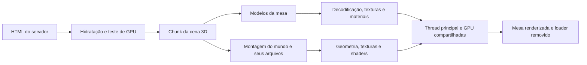

**Análise de carregamento do Skybound — 15/09/2026**

Execução posterior: [implementação, medições finais e limites](loading-implementation.md).

Há espaço para reduzir bastante a espera. O principal problema observado é a disputa pela preparação da cena: mesa, terreno, vegetação, personagens e shaders trabalham juntos antes de revelar o lobby. Melhorar apenas o servidor ou reduzir os bytes não elimina esse custo.

Análise da revisão `01ff9463483ace62034cb3112ea611ab914b61af`, incluindo os cinco personagens. Nenhuma mudança de comportamento ou qualidade visual foi aplicada nesta investigação. O resultado é um diagnóstico, experimentos de isolamento e um plano de execução.

**Medições e limites**

Build de produção do Next 16.1.2 em `localhost:3004`, Chromium com GPU NVIDIA RTX 3050 Laptop, 1440×900, DPR 1. Navegadores executados sequencialmente. Nove casos sem profiler V8 e dois casos adicionais com amostragem de CPU. Os testes usam instrumentação de tempo, portanto os números têm algum overhead. Aplicações do desktop podem disputar recursos; caches do sistema operacional e do driver podem estar quentes.

“Pronto” significa o marco `data-lobby-state=idle`, após a fronteira da mesa montar e observar dois callbacks de frame. Isso não comprova que todo o cenário terminou nem mede precisamente a apresentação do primeiro pixel do canvas.

| Cenário | Mesa pronta | Interpretação |
|---|---:|---|
| Primeira visita, rede local, três execuções | 8,35 / 9,16 / 9,45 s | Mediana 9,16 s; a rede local é rápida |
| Nova página usando o cache da primeira visita | 8,87 s | Quase nenhum corpo HTTP transferido; processamento persiste |
| Mundo retido até a mesa ficar pronta, duas execuções | 2,65 / 2,83 s | Isolamento: o cenário ainda está incompleto nesse momento |
| Primeira visita, 20 Mbps e 40 ms simulados | 11,11 s | Rede passa a ser uma parte relevante da espera |
| Mundo retido, mesma limitação de rede | 3,39 s | Isolamento, não resultado de uma implementação acabada |
| CPU desacelerada 4×, rede local | Não atingiu `idle` em 35 s de espera | Teste de estresse; não representa uma GPU fraca real |

No caso de CPU 4×, a cena já não estava disponível para consultar o renderer ao final. O código possui um escape de 20 s contado após a montagem de `DeskScene`; esse mecanismo também precisa de tempo livre na thread principal para executar. Não interpretar a ausência de erros de console como carregamento bem-sucedido.

O experimento “mundo retido” segura solicitações de `/lobby/world/` com CDP e libera todas após `idle`. Não remove componentes síncronos, nem equivale a uma otimização pronta para publicar. A diferença de aproximadamente seis segundos demonstra interferência evitável, mas não pode ser prometida integralmente para uma composição visual completa.

Dados: [medições](../implementation/loading-audit/measurements.json), [arquivos efetivamente carregados](../implementation/loading-audit/loaded-assets.json), [waterfall inicial](../implementation/loading-audit/cold-waterfall.json), [amostragem de CPU](../implementation/loading-audit/cpu-samples.json).

**O caminho atual**



1. `app/page.tsx` já é um Server Component. Lê o user-agent para excluir o lobby no mobile, tornando `/` dinâmico neste build. TTFB local nos três casos iniciais: aproximadamente 11–84 ms, pequeno frente aos 8–9 s totais. Isso não mede a infraestrutura publicada.
2. `lobby-gate.tsx` espera hidratação e teste de GPU para montar o componente `dynamic(..., { ssr: false })`. O grande chunk 3D começou a baixar aos 833 ms no primeiro caso: aproximadamente 307 kB transferidos, 1,12 MB de JavaScript descomprimido.
3. Só ao avaliar esse código `lib/lobby/assets.ts` dispara os 11 `useGLTF.preload()`. Há paralelismo entre modelos, mas a descoberta desses arquivos ocorre tarde.
4. `desk-scene.tsx` monta o mundo imediatamente, mesmo em `loading`. `active=false` pausa algumas animações; não suspende downloads, geração de geometria, upload de texturas ou a renderização inicial.
5. A mesa inteira compartilha uma fronteira Suspense, incluindo Nintendo DS, figuras, baralhos e outros objetos. Todos participam do bloqueio da entrada.
6. `SceneReady` espera frames, corretamente, mas esses frames disputam a mesma CPU/GPU com todas as fronteiras opcionais. Suspense separa dependências; não reserva capacidade de processamento.

No primeiro caso, os 11 GLBs da mesa terminaram de baixar aos **992 ms**, mas `idle` veio aos **9.160 ms**. A diferença inclui decodificação, outras dependências da mesa, montagem React e preparação/renderização compartilhada; não são oito segundos de download do GLB da mesa.

**Onde o tempo está sendo gasto**

| Evidência | Resultado | Implicação |
|---|---|---|
| `texSubImage2D`, antes de `idle` | 147 chamadas, 1,52 s acumulados, até 155 ms numa chamada | Preparar e enviar imagens para a GPU bloqueia a thread |
| Consultas de logs dos shaders/programas | 1,96 s acumulados no terceiro caso | Há esperas síncronas pela preparação dos programas |
| Programas ligados antes de `idle` | 134 | Grande variedade de materiais e passes no começo |
| Maior tarefa longa, três casos iniciais | 1,24–1,39 s | A interface pode ficar sem responder por intervalos perceptíveis |
| Amostragem V8 separada | 0,81 s no hash de ruído e 0,40 s no cálculo de morros | Parte estática do terreno continua sendo recalculada para cada visitante |

Tempos WebGL são **tempo de CPU dentro das chamadas**, incluindo esperas síncronas; não são medições diretas de execução da GPU. As linhas não compõem uma decomposição exaustiva da espera. O perfil V8 é outra execução, com overhead adicional, e não deve ser somado às demais colunas.

A função de primeiro uso de `WebGLProgram` concentrou cerca de 2,09 s de amostras no perfil. O terceiro caso instrumentou especificamente as consultas de logs e confirmou esse custo. `KHR_parallel_shader_compile` está disponível na máquina usada. Isso justifica testar preparação assíncrona dos materiais antes de anexar cada grupo à cena. Apenas desligar os diagnósticos não elimina necessariamente a espera: consultas posteriores também podem esperar o programa terminar.

**Bytes, texturas e cache**

Na primeira execução, foram observados aproximadamente **28,57 MB HTTP**, incluindo aplicação e arquivos da cena. Os corpos de `/lobby/` descomprimidos somam aproximadamente **34,90 MB**. Não confundir os tamanhos físicos dos GLBs, compressão HTTP e tamanho da textura preparada na GPU.

| Arquivo/grupo carregado | Tamanho físico | Observação |
|---|---:|---|
| 11 modelos da mesa | 4,83 MB | Todos entram na fronteira crítica atual |
| `organic-tree_small_02.glb` | 7,88 MB | Sozinho corresponde a aproximadamente 23% dos corpos de `/lobby/` |
| `rock-face-detail.webp` + `rock-face-normal.webp` | 3,39 MB | Duas imagens 2048² do terreno |
| `chess-monuments.glb` | 2,16 MB | Marco distante, bom candidato a preparação posterior |
| `nintendo-ds.glb` | 1,97 MB | Objeto secundário da mesa bloqueando a mesma fronteira |
| Cinco personagens + corte de Ainz | 5,03 MB de GLBs | Importantes para o mundo, mas não precisam todos bloquear o primeiro quadro |

O pinheiro `organic-pine_tree_01.glb`, de 8,51 MB no disco, **não apareceu no carregamento medido**. Otimizar ou apagar arquivos grandes que não são solicitados não reduz este loading.

As imagens embutidas nos GLBs carregados equivalem a aproximadamente 682 MiB se representadas como RGBA8 com mipmaps; imagens externas acrescentariam cerca de 103 MiB. É um inventário teórico, **não VRAM medida**: ignora compartilhamentos, formatos internos, clones, buffers, alvos de renderização e texturas procedurais. O GLB da mesa sozinho contém 23 imagens 1024², equivalentes a aproximadamente 123 MiB nessa conta, apesar de pesar apenas 747 kB em disco.

Os arquivos de `public/lobby/` usam `Cache-Control: public, max-age=0`. Na repetição, os 11 modelos da mesa tiveram respostas observadas de cerca de 244–245 bytes cada, compatíveis com revalidação e reaproveitamento do corpo. A página inteira transferiu aproximadamente 40 kB no período observado, mas levou 8,87 s para mostrar a mesa. O cache HTTP evita retransmissão; não preserva objetos Three, texturas da GPU e toda a preparação entre páginas novas. O [comportamento padrão de `public` é documentado pelo Next](https://nextjs.org/docs/app/api-reference/file-conventions/public-folder).

A 20 Mbps, os aproximadamente 28,57 MB observados exigiriam cerca de 11,4 s de transmissão ideal se todos fossem necessários antes da exibição. Portanto, para mostrar algo completo e útil cedo, precisamos reduzir o conjunto inicial e/ou seus bytes, além do processamento.

**O que pode ir para o servidor ou para o build**

| Trabalho | Onde faz sentido | Limite |
|---|---|---|
| HTML, textos, SEO e estrutura | Server Components/SSR, já parcialmente usados | Não prepara os recursos WebGL do visitante |
| Geometria estática do terreno, normais, máscaras de trilhas e copas | Build: gerar arquivos binários e texturas uma vez | Precisa preservar o domínio de alturas e a composição atual |
| Posições e matrizes estáticas de vegetação/construções | Build, em coordenadas relativas ao chão | Atualizar artefatos quando o layout ou gerador mudar |
| Otimização de GLBs, texturas e animações | Pipeline de assets no build | Avaliação visual obrigatória para compressão com perda |
| Descoberta antecipada de arquivos essenciais | HTML com preload ou bootstrap pequeno | Priorizar poucos; evitar baixar o mundo para mobile/reduced motion |
| Entrega dos arquivos | CDN e URLs versionadas | Ajuda rede e revisitas, não substitui decode/upload |
| Materiais WebGL, buffers, contexto e desenho interativo | GPU/browser do visitante | Não se transferem como estado pronto via React Server Components |

A nuvem já é calculada offline e servida em três volumes comprimidos; é um precedente útil para terreno e máscaras. Executar novamente esses cálculos a cada requisição SSR traria custo ao servidor sem necessidade. O ideal é fazê-los uma vez por versão.

O servidor pode fornecer uma **prévia temporária do primeiro enquadramento**, substituída quando o 3D estiver pronto. Isso melhora a primeira impressão; não é redução do tempo real de preparação. Deve ser medido separadamente, mantendo uma indicação honesta de carregamento. A visualização final continua sendo o mundo 3D.

Renderizar o jogo inteiro num servidor com GPU e transmitir vídeo seria outra arquitetura, com streaming, latência e custo operacional. Não é uma aplicação comum de SSR e não é a recomendação para este portfólio. [Server e Client Components do Next](https://nextjs.org/docs/app/getting-started/server-and-client-components) dividem código/HTML, não transportam um contexto WebGL pronto.

**Ordem recomendada de implementação**

1. **Controlar a preparação por etapas.** Definir um conjunto inicial coerente: mesa/monitor, chão próximo, base do céu e silhuetas principais da paisagem. Desacoplar objetos secundários da fronteira crítica. Preparar gradualmente vegetação detalhada, personagens, materiais e texturas, com limite de trabalho por frame. Fazer a transição com a composição preenchida; revelar uma mesa sobre fundo vazio não satisfaz o objetivo visual. O experimento de 2,65–2,83 s prova o potencial de reduzir disputa, não o tempo final dessa proposta.
2. **Retirar geometria e mapas estáticos do runtime.** Exportar o resultado exato de `landGeometry`, `TerraceTerrain`, máscaras de trilha/copa e construções mescladas. `groundMaterial()` é criado tanto para a região próxima quanto para o vale, gerando suas próprias máscaras. Compartilhar os dados imutáveis e possuir explicitamente o ciclo de vida das texturas. `useBakedGeometry()` ainda clona e transforma vértices; avaliar exportar esses dados já prontos. Preservar os mesmos geradores e verificar igualdade/tolerância numérica para não alterar o terreno.
3. **Testar KTX2/Basis nas texturas mais caras.** WebP reduz download, mas as imagens ainda viram texturas descomprimidas no fluxo atual. KTX2 permite transcoding para formatos comprimidos suportados pela GPU. Começar com mesa, árvore e mapas de rocha; comparar UASTC e alternativas adequadas a cada tipo de mapa, mantendo normal maps, transparência e cor corretas. Conferir nitidez no enquadramento real e medir bytes, transcoding e upload; UASTC pode aumentar o arquivo em relação ao WebP. Usar mipmaps preparados no build. [KTX2Loader](https://threejs.org/docs/pages/KTX2Loader.html) requer detectar suporte do renderer antes da carga: os preloads atuais no escopo do módulo precisarão separar download antecipado de parsing configurado. O script antigo `compress-assets.ts` menciona KTX2 num comentário, mas executa WebP; KTX2 não está ativo hoje.
4. **Preparar shaders sem bloquear tudo de uma vez.** Testar `renderer.compileAsync()` por grupo com luzes, sombras e materiais definitivos, incluindo variantes de profundidade. Preparar texturas em lotes separados. Aguardar a compilação de todo o mundo antes de revelar a mesa manteria uma barreira grande. Compilação assíncrona distribui/antecipa espera; não elimina trabalho da GPU. A API é recomendada na [documentação de WebGLRenderer](https://threejs.org/docs/pages/WebGLRenderer.html); [MDN explica as consultas bloqueantes e a extensão paralela](https://developer.mozilla.org/en-US/docs/Web/API/WebGL_API/WebGL_best_practices).
5. **Antecipar somente o necessário.** Extrair o manifesto da mesa de `lib/lobby/assets.ts` para um módulo sem Drei/Three. Assim podemos descobrir os arquivos principais antes de baixar/avaliar o motor. Usar preload com modo/credenciais compatíveis com o loader, verificar ausência de download duplicado e preservar o bypass mobile/reduced motion. Evitar preload de todos os assets. [React oferece preload durante a renderização do servidor](https://react.dev/reference/react-dom/preload).
6. **Versionar arquivos e configurar cache duradouro.** URLs com hash ou versão mais `max-age` longo e `immutable`, servidas por CDN. Não aplicar cache imutável aos nomes mutáveis atuais: uma atualização poderia manter modelos antigos no browser. Verificar CDN, compressão e HTTP/2/3 na implantação real; estas medições foram locais em HTTP/1.1. Service worker é uma opção posterior para revisitas/offline, com estratégia de invalidação e limite de armazenamento, não prioridade para a primeira visita.
7. **Carregar apenas o detalhe que o enquadramento exige.** Separar a grande árvore em níveis de detalhe/arquivos; usar os impostores já existentes para longe e geometria detalhada perto. Recortar o conjunto exportado à área visível e às margens necessárias para sombras/paralaxe. O culling atual economiza desenho, mas os arquivos já foram baixados/decodificados. LOD dentro de um GLB único também não reduz seu download inicial. Revisar atlas e materiais duplicados sem redesenhar a mesa.
8. **Suspender trabalho encoberto e adiar periféricos.** `Contact/LiquidBackground` cria outro contexto WebGL e mantém rAF enquanto está encoberto; os três vídeos HTML estão em autoplay. Os vídeos transferiram apenas cerca de 147 kB no caso inicial, portanto são uma limpeza útil, não a causa principal. O áudio sintetiza todos os efeitos e a ambiência ao montar; preparar sob demanda ou depois do núcleo visual. A hero/ASCII já têm suspensão implementada, que deve ser preservada.
9. **Tratar bundle e workers conforme o perfil.** O chunk 3D tem custo real de descoberta/avaliação. Separar cenário tardio do núcleo exige mover `dimWorldMaterials` de `isekai-world.tsx`, pois `DeskEnvironment` importa esse módulo diretamente. Draco já usa loader compartilhado; comparar Meshopt/Draco/sem compressão em poucos assets críticos, medindo download mais decode. Workers podem calcular dados e devolver buffers transferíveis; não tornam gratuitamente paralelos React ou todo o grafo Three. Para dados fixos, build é mais simples e elimina o cálculo por visita. OffscreenCanvas exigiria revisar eventos, loaders, canvas 2D e integração R3F; considerar apenas se o perfil residual justificar.
10. **Ajustar o primeiro render e estabelecer orçamento.** Preparar sombras e nuvens por etapas; considerar DPR inicial 1 e evolução conforme a capacidade, preservando resolução final. Isso ajuda desenho, não os bytes. Definir orçamento de bytes críticos, imagens/texturas preparadas, variantes de shader e tarefas longas. Não usar novamente um timer de progresso para aparentar que terminou.

As intervenções mais promissoras são **etapas de preparação + dados estáticos no build + texturas adequadas à GPU + shaders assíncronos**. Cache/preload completam essa arquitetura. Não há evidência para prometer um ganho específico antes de implementar e medir cada etapa.

**Como avaliar a próxima implementação**

- Separar quatro métricas: primeira prévia visível, primeira cena 3D coerente, interação disponível e mundo enriquecido completo. `networkidle`, FCP/LCP de HTML e `idle` da mesa não medem a mesma coisa.
- Repetir produção em primeira visita e cache, rede rápida e 20 Mbps/40 ms, DPR 1/1,5, CPU limitada e ao menos um equipamento com GPU integrada real. Medir p75/p95 depois com amostras de visitantes, não estimar percentis populacionais a partir desses poucos testes.
- Comparar capturas da mesma câmera: mesa, chão, céu, rio, sombras e referências devem manter cor, nitidez e enquadramento. Verificar entrada pelo monitor, teclado, skip, StrictMode, aba oculta, mobile, reduced motion e falha de um asset opcional.
- Como objetivo inicial de engenharia, testar uma cena coerente e utilizável em aproximadamente **3–4 s na máquina/rede rápida desta auditoria**, sem travadas grandes ao enriquecer o mundo. É uma meta para validar, não um resultado obtido. Em 20 Mbps será necessário limitar bastante os bytes críticos; o mundo completo pode continuar preparando detalhes depois.
- Evitar afirmar que o site está rápido só porque trocamos o loader por uma imagem. A prévia e o 3D precisam ter marcos separados.

**Reprodução e artefatos**

```sh
npm run build
npm run start -- --port 3004
PLAYWRIGHT_CHROMIUM_EXECUTABLE_PATH=/path/to/native/chrome \
  AUDIT_URL=http://localhost:3004 AUDIT_OUTPUT=/tmp/loading-audit \
  node scripts/audit-lobby-loading.mjs

# Novos casos de isolamento e CPU limitada:
PLAYWRIGHT_CHROMIUM_EXECUTABLE_PATH=/path/to/native/chrome \
  AUDIT_CASES=cold-3,world-held-2,cpu-4 \
  node scripts/audit-lobby-loading.mjs

# Perfil V8 separado (com overhead adicional):
PLAYWRIGHT_CHROMIUM_EXECUTABLE_PATH=/path/to/native/chrome \
  AUDIT_CPU_PROFILE=1 AUDIT_CASES=cold,world-held \
  AUDIT_OUTPUT=/tmp/loading-audit-profile \
  node scripts/audit-lobby-loading.mjs
```

O coletor não altera a aplicação. Cada caso registra recursos, tarefas longas, chamadas WebGL, erros e prontidão; os casos de isolamento liberam todas as solicitações retidas. Os resultados resumidos e waterfalls estão versionáveis em `implementation/loading-audit/`. A amostra com CPU limitada não chegou ao marco esperado; os demais casos registraram prontidão sem erros de página/console. Build de produção e ESLint do coletor passaram.
